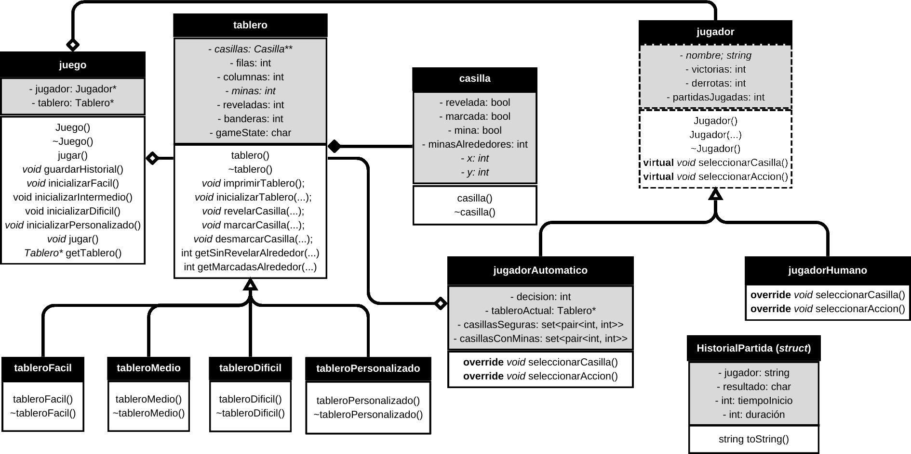

# minesweeper
Minesweeper is a classic computer reasoning game where the user must reveal all the squares without accidentally uncovering a mine. Each square can have a number from zero to eight, representing the number of bombs in the eight adjacent squares. Revealing an empty square with a zero also unlocks adjacent squares with zeros.

This game was originally introduced in 1989, initially programmed in C. The objective of this project is to simulate the game’s functionality by implementing classes (i.e., adapting C++ functionalities in video game development) and a history system, including a basic automatic player.

This program was developed as my final project for the Programming 2 course at UTEC. Please note that the program is entirely in Spanish.

## Classes

